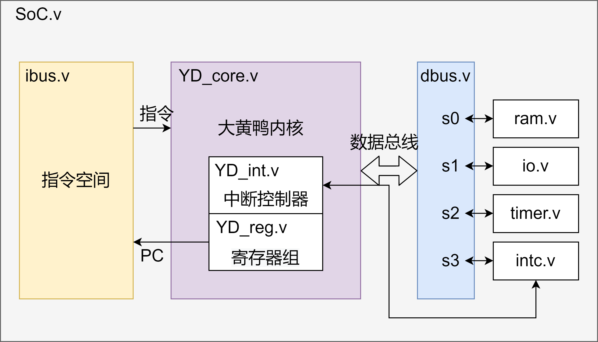

# 大黄鸭处理器  

### 简介
本项目将从零开始，设计一套单核16位处理器。为此，我将自己设计一套全新的计算机指令集，代号“大黄鸭”；根据大黄鸭指令集，设计处理器内核，实现指令集的所有功能；为处理器布置必要的外设，如IO口；设计汇编器，让程序编写变得更友好。  

#### 本项目包含以下内容：  
**1. 大黄鸭指令集设计**  
- 全新设计的大黄鸭指令集
- 加载存储结构
- 16条指令，8/16位长度，16个寄存器，16位数据/地址位宽  

**2. 大黄鸭处理器设计**  
- 哈佛结构
- 两级流水线，所有指令单周期执行
- 8位指令双发射
- 带有数据总线
- IO寄存器映射  

**3. 大黄鸭汇编器脚本**  
- 将大黄鸭汇编程序转换为处理器可执行的二进制代码
- 容许#开头的单行注释
- 语法检查
- 立即数溢出检查
- 写入冲突检查
- [汇编器GUI版](https://gitee.com/xiaowuzxc/Yduck-Assembler-GUI)  

#### 项目文档
[大黄鸭指令集](https://gitee.com/xiaowuzxc/Yduck-processor/blob/master/doc/%E5%A4%A7%E9%BB%84%E9%B8%AD%E6%8C%87%E4%BB%A4%E9%9B%86.md)  
[大黄鸭汇编器](https://gitee.com/xiaowuzxc/Yduck-processor/blob/master/doc/%E5%A4%A7%E9%BB%84%E9%B8%AD%E6%B1%87%E7%BC%96%E5%99%A8.md)  
[存储单元特性](https://gitee.com/xiaowuzxc/Yduck-processor/blob/master/doc/%E5%AD%98%E5%82%A8%E5%8D%95%E5%85%83%E7%89%B9%E6%80%A7.md)  
[系统结构](https://gitee.com/xiaowuzxc/Yduck-processor/blob/master/doc/%E6%80%BB%E7%BA%BF%E7%BB%93%E6%9E%84.md)  

#### 开发工具
正所谓：工欲善其事，必先利其器。  
- 处理器RTL设计采用Verilog-2001，此版本具有很多好用的特性，并且受到综合器的广泛支持。  
- 处理器RTL验证采用System Verilog-2005，此版本充分满足使用需求，并且受到仿真器的广泛支持。  
- 数字逻辑仿真采用iverilog，这是一个跨平台的开源软件，可以快速地安装和使用。后期会加入VCS。  
- 汇编器采用Python3，脚本语言清晰易懂，搭配正则表达式便于文本操作，跨平台并且Python3对中文有着良好的支持。  

### 杂谈:我为什么要做大黄鸭
本项目开坑没有什么特殊原因~~纯属脑子一热~~。开坑前，我正沉迷于学习FPGA和计算机体系结构，研究各种指令集(RISC-V,MIPS,8051...)，使用各种嵌入式处理器，移植tinyriscv,e203等各种开源处理器，甚至去看了看古董(~~川口三~~6205,经典8051)。

看了各种各样指令集架构，它们都有让我喜欢和感到变扭的地方，RISC-V简洁但有些操作不方便，51虽古老但有很多闪光点，等等。千奇百怪的处理器，我越看越入迷，越看越有灵感，同时，心中也不可抑制地产生了一种想法，那就是，我能不能自己设计一套指令集？

原本我觉得这想法很可笑，毕竟我才学了一年的verilog，水平不怎么样，写处理器如同蚂蚁想要推到大树一般自大而无畏。但是，我又觉得，或许可以尝试一下。不需要这个指令集有多么优秀，能够拳打ARM脚踢RV，只要合我心意，满足最基本的顺序、选择、循环结构，可以使用汇编编写指令，对我来说，就足够了。

我有个习惯，那就是从来不打没准备的仗。热血上头的那天晚上，横竖睡不着觉，脑子里不停构思指令集怎么设计，16位一条指令怎么分配，用哈佛还是冯诺依曼。慢慢的思考，大黄鸭指令集就如拨云见日，从模模糊糊到清晰可见；把脑子里构思的指令集一条一条写下来，我觉得我能看到希望了；根据指令集在脑子里切出个2级流水线，我觉得可以动手了；翻了翻verilog手册和计算机体系结构，我充满了信心。于是，开坑！！！  
