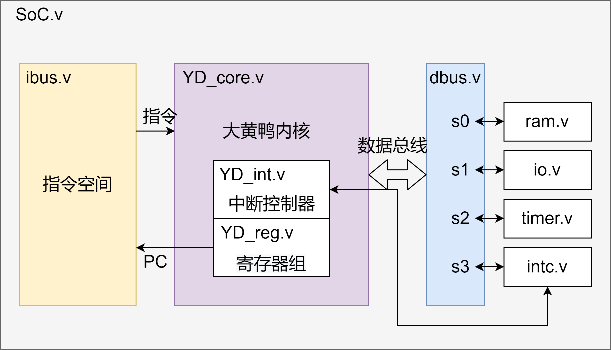

0# 大黄鸭处理器的系统结构
大黄鸭处理器采用哈佛结构，指令总线连接指令空间和处理器内核，数据总线连接数据空间和处理器内核。  

### 内核
大黄鸭内核拥有16位运算位宽，16位地址线，16位指令，16位数据位宽，16个寄存器。  
指令、数据空间必须且只能2字节对齐。  
哈佛结构，指令地址与数据地址分离。  
IO寄存器映射实现。  
内嵌中断控制器，可以实现非向量中断。  
双发射，两条8位指令可并行执行。  
2级流水线，发生跳转则使用2周期空指令填充流水线。  

### 指令总线
指令总线为16位地址位宽、16位数据位宽。  
只有一个主设备(处理器内核)和一个从设备(指令空间中的指令存储器)，因此可以当作没有总线，处理器内核直接访问指令存储器。

### 数据总线
数据总线为16位地址位宽、16位数据位宽。  
一主多从结构，主设备指处理器内核，从设备包含了SRAM、寄存器映射IO等多种(可能不多)外设。  
数据总线把数据空间分为16个区块，地址线[15:12]用于选择区块。  
每个区块有12条[11:0]地址线，16位数据位宽，可以寻址4k个单元，或者2^12x(16/8)=8kB空间。
数据总线有且只能有一个主设备，所有通信由主设备发起。主设备同时只能访问一个区块，所有区块的读写时序必须一致。  
#### RAM
RAM存储器位于数据总线的s0，基地址0x0000，地址范围0x0000-0x0FFF。  
Verilog行为级建模，在FPGA IDE上可以被综合成BRAM。RAM_AW参数决定了RAM的容量和地址位宽，未定义则默认为7。
#### IO
IO外设位于数据总线的s1，基地址0x1000，地址范围0x1000-0x1FFF。  
|寄存器|偏移地址|功能|
|----|----|----|
|gpio_in_reg|0x00|只读，输入端口数据|
|gpio_out_reg|0x01|读写，输出数据|
#### timer
timer定时器外设位于数据总线的s2，基地址0x2000，地址范围0x2000-0x2FFF。  
兼具定时器与PWM发生器的功能，定时器溢出发出中断请求。  
有一个分频器DIV和两组定时器T0/T1，主时钟通过分频器为两组定时器提供计数信号。  
#### intc
intc中断管理器位于数据总线的s3，基地址0x3000，地址范围0x3000-0x3FFF。  
中断管理器负责管理所有的外设/外部中断请求，并与大黄鸭内核中的中断控制器进行交互。  
最多可以管理8个中断通道，2级优先级。